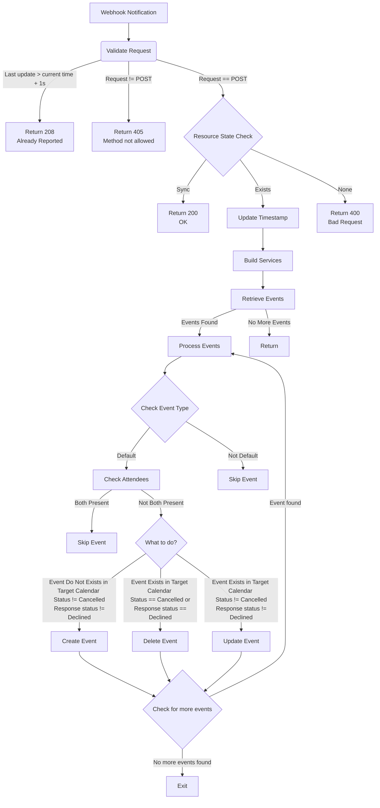

This tutorial shows easy way to get thing running.  

### Requirements  
Python 3.10  
    Check your version: 
    ```
    python --version
    ```

### Set up virtual environment  
Install virtual env.  
    ```python -m venv venv```  
Start virtual env.  
    ```.\venv\Scripts\activate```


### Install packages  
```pip install -r requirements.txt```

### Configure
Edit file config.ini.  
Description of variables. Don't use quotes, scopes have to be in parenthesis [ ].

| VARIABLE | EXAMPLE | DESCRIPTION |
| -------- | ------- | ----------- |
| SCOPES | ["https://www.googleapis.com/auth/calendar.events"] | List of scopes, to use this program you don't have to change it |
| CALENDAR_ID | username@gmail.com | Main calendar e-mail address, don't use 'primary' it will cause issues when checking the 'responseStatus' of attendees.|
| TARGET_CALENDAR_ID | 73c4p8b3qdk82jnof68@group.calendar.google.com | Target calendar to where events are copied. |
| WEBHOOK_URL | https://username.pythonanywhere.com/notifications | URL to where your program is instantiated. Must be HTTPS! for webhook to work. |
| TOKEN_PATH | credentials\token.json | Path to CALENDAR_ID token. Need to login with Google OAUTH. |
| TARGET_TOKEN_PATH | credentials\target_token.json | Path to TARGET_CALENDAR_ID token. Need to login with Google OAUTH. |
| CREDENTIALS_PATH | credentials\credentials.json | Credentials downloaded from Google Cloud https://console.cloud.google.com/auth/clients |
| GOOGLE_APPLICATION_CREDENTIALS | /home/username/your-file.json | Path to Google CLoud service account key. |
| SAME_USER | True / False | Bool. If Target calendar is sub calendar for Main calendar then use True. Otherwise use False. |
| PREFIX | [WORK] | Prefix that will be added to summary. |
| COLOR | 9 | Integer from range 0-11. 0 means default for Target calendar.
| SUFFIX | This event was created by Google Calendar Sync script. <br> Made by wolk.tomasz@gmail.com | Suffix added to description. | 

### Create tokens  
Create Google Cloud project (example https://developers.google.com/people/quickstart/python).

- Enable Google Calendar API
- In "Audience" add users - primary emails for Main and Target Calendars
- In "Data Access" add Scope: "./auth/calendar.events"
- In "Clients" create OAuth 2.0 desktop client and download credentials.json to folder credentials.

Run ```python .\utils\project_config_class.py```  

Log to your accounts using OAuth:

- First log to Main calendar (from where events will be copied).  
- Second log to Target calendar (to where event will be copied). <br> 
    If 'SAME_USER = True' then second logging will be skiped.  

### Run serwer with HTTPS and start program.  
You can use external serwer, example PythonAnywhere.com.  
Create flask serwer and copy files to /home/username/mysite/  
Remember to change name of project.py to flask_app.py and change in config.ini 
WEBHOOK_URL to your url.

### Graph showing how script works.


### Directory tree
```
CS50 Python Final Project
|
|   test_project.py
|   project.py
|   config.ini
|   requirements.txt
|   project_notification_channel_class.py
|   project_config_class.py
|   project_event_data.py
|   logger_class.py
|   credentials.json
|   token.json
|   target_token.json
|
+---logs
        app.log
```